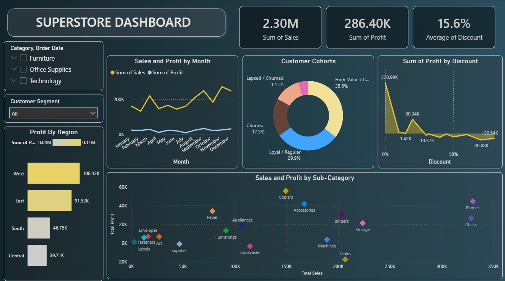

# Global Superstore Performance & Profitability Analysis

An end-to-end Power BI business intelligence and executive reporting system engineered to optimize retail margins. This project processes over 9,900 transaction records to pinpoint critical regional profit leakages, evaluate localized promotional discounting behaviors, and implement a DAX-driven customer lifetime value (LTV) cohort segmentation framework.

## 🚀 Key Features & Highlights
* **Pure Power BI Architecture:** Built completely within Power BI Desktop utilizing Power Query for schema optimization and modeling.
* **Advanced DAX Engineering:** Features custom calculations for complex margin percentages, running transaction summaries, and a dynamic customer cohort model.
* **Interactive Executive Dashboard:** Designed with clear information architecture principles—including a core KPI strip, conditional visual matrices, and comprehensive cross-filtering parameters.
* **Actionable Business Discoveries:** Direct tracking of high-revenue, negative-profit deficit zones (e.g., Texas, Ohio) and underperforming loss-leader inventory tracks (e.g., Tables).

---

## 📊 Business Performance Dashboard
Below is an interactive view of the engineered executive storefront analytics reporting interface:



*Figure 1: Finished Power BI Executive Analytics Interface showcasing core KPI strips, operational timelines, regional matrices, and category breakdowns.*

---

## 🛠️ Data Architecture & Implementation Pipeline

### 1. Data Profiling & Structural Transformations (Power Query)
* **Date Parameter Synchronization:** Parsed and cleaned timestamp indicators into standard uniform temporal configurations (`Order Date`, `Ship Date`) to power strict time-intelligence visuals.
* **Spatial Categorization:** Mapped geographic dimension strings (`Country`, `State`, `City`) to standard spatial attributes for high-fidelity interactive map plotting.
* **Data Typology Optimization:** Verified numeric constraints, adjusted currency values for financial indicators (`Sales`, `Profit`), and filtered duplicate record lines.

### 2. Relational Modeling
The semantic layer models a single-to-many (`1:*`) relationship structure connecting distinct dimensions to granular order row facts. This ensures clean filter propagation without performance degradation or circular dependencies during multi-axis slicing.

### 3. DAX Engineering Core Measures
Custom measures were formulated to isolate underlying profitability trends beyond basic auto-aggregations:

```dax
-- Foundational Performance Measures
Total Revenue = SUM('Sample - Superstore'[Sales])
Net Profit = SUM('Sample - Superstore'[Profit])
Profit Margin % = DIVIDE([Net Profit], [Total Revenue], 0)
Total Orders = DISTINCTCOUNT('Sample - Superstore'[Order ID])
